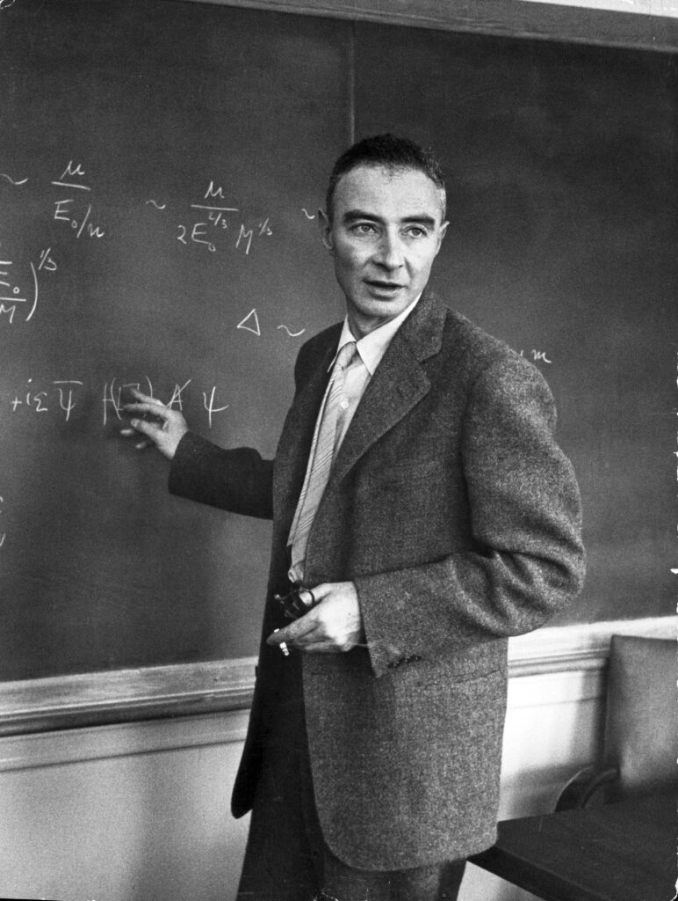

```{r setup, include=FALSE,highlight=TRUE, background='#F7F7F7'}
library(tufte)
# invalidate cache when the tufte version changes
knitr::opts_chunk$set(cache.extra = packageVersion('tufte'))
options(htmltools.dir.version = FALSE)
```

::: {.fullwidth} 
Walking around the University of Warsaw library, visitors might pause to admire the elegant Sanskrit inscriptions that grace its walls as part of a comprehensive tribute to classical languages and civilizations. It is a stunning display of texts in Hebrew, Polish, Sanskrit, as well as musical notation and mathematical symbols. At first glance, the Sanskrit text appear as a single, flowing text beautiful yet mysterious to most passersby. However, a closer examination reveals something far more intriguing: these aren't verses from a single source, but rather a carefully curated mosaic of some of Hinduism's most sacred texts.
:::

```{r figAll, fig.margin = TRUE, fig.cap = "The Warsaw University Library wall featuring aspects of music,culture and sciences.", message=TRUE, cache=TRUE, echo=FALSE, out.width='100%'}

```

```{r figArabic, fig.margin = TRUE, fig.cap = "The Warsaw University Library wall also features an Arabic calligraphy. It is apparently from a poem by the 8th century Arabic polymath Al-Jahiz (https://en.wikipedia.org/wiki/Al-Jahiz). As per Dr Mohammad S. Razai  (https://linktr.ee/mohammadrazai), the translation is: *The book is the teacher that if you cut off material from it, it does not cut off benefit from you. If you are isolated, it does not cease obeying you, and if the wind of your enemies blows, it does not turn against you. Whenever you are attached to it with the slightest rope, it is sufficient for you instead of others, and with it, the loneliness does not compel you to a companion of evil.*", message=TRUE, cache=TRUE, echo=FALSE, out.width='100%'}

```

```{r figTimelineEpic, fig.margin = TRUE, fig.cap = "Timeline of the ancient Indian scriptures as per Klostermaier (https://archive.org/details/conciseencyclopediaofhinduism_364_V/). ", message=TRUE, cache=TRUE, echo=FALSE, out.width='100%'}

```

What initially seemed like one continuous passage gradually revealed itself to be a thoughtful compilation, weaving together excerpts from the Gayatri mantra, the Upanishads, and the Bhagavad Gita. The seamless integration of these texts, presented without clear demarcation between sources, creates both a puzzle for the curious observer and a testament to the interconnected wisdom of ancient Indian philosophy. This discovery opens a fascinating window into how these foundational texts speak to each other across centuries. 

Growing up, I picked up some Sanskrit in school for about three years and heard these verses being chanted everywhere at home, temples, rituals, you name it. Being the rebellious, non religious kid I was, I didn't really care much about it back then. But I've always been curious and fascinated by all the stories, teachings, and wisdom packed into these ancient texts.

```{r figSanskritMain, fig.margin = FALSE, fig.cap = "", message=TRUE, cache=TRUE, echo=FALSE, out.width='100%'}

```

# Part 1: The Sacred Beginning: The Gayatri Mantra


```{marginfigure, fig.cap="Your caption here"}
**Meaning:** ॐ (OM) The Universal, Primitive Sound;  
**भू** (BHU) The Earth;  
**भुवः** (BHUVA) The celestial world or sky;  
**स्वः** (SVAHA) Paradise, heaven;  
**तत्** (TAT) "That", the Ultimate Reality;  
**सवितु** (SAVITUR) Goddess of Energy (Savitu, Savitri, Gayatri);  
**वरेण्यं** (VARENYAM) Brilliant;  
**भर्गो** (BHARGO) Reputed;  
**देवस्य** (DEVASYA) Divine Entities;  
**धीमहि** (DHIMAHI) We meditate;  
**धियो यो** (DHIYO YO) Intelligence;  
**नः** (NAH) Our;  
**प्रचोदयात्** (PRACHODAYAT) Inspire, guide.
```

```{marginfigure, fig.cap="A quote from Amartya Sen's book"}
*"The Vedas may be full of hymns and religious invocations, but they also tell stories, speculate about the world and true to the argumentative propensity already in view ask difficult questions. A basic doubt concerns the very creation of the world: did someone make it, was it a spontaneous emergence, and is there a God who knows what really happened? The Rigveda goes on to express radical doubts on these issues: 'Who really knows? Who will here proclaim it? Whence was it produced? Whence is this creation? … perhaps it formed itself, or perhaps it did not the one who looks down on it, in the highest heaven, only he knows or perhaps he does not know.' These doubts from the second millennium BCE would recur again and again in India's long argumentative history, along with a great many other questions about epistemology and ethics. They survive side by side with intense religious beliefs and deeply respectful faith and devotion."* Amartya Sen, The Argumentative Indian: Writings on Indian History, Culture and Identity
```
We meditate on the glory of the Creator who has created the Universe, who is worthy of worship, who is the embodiment of Knowledge and Light, who is the remover of all sins and ignorance. May He enlighten our intellect.
These words, known as the Gayatri Mantra, have echoed through millennia as one of Hinduism's most sacred invocations. But beyond this prayer lies a rather profound philosophical framework that distinguishes between two fundamentally different types of knowledge. 


That's loosely the translation^[Like most ancient texts, this has been translated many times, generating countless interpretations that vary widely from rigorous scholarly analysis to more speculative (and some outlandish) readings depending on each interpreter's background and viewpoint.] of the first two lines of the wall depiction. 

त्सवितुर्वरेण्यं भर्गो देवस्य धीमहि। धियो यो नः प्रचोदयात् ॥

which reads: 
"tatsaviturvareṇyaṃ bhargo devasya dhīmahi. dhiyo yo naḥ pracodayāt", is a verse from the beginning of
the famous Gayatri Mantra from the Rig Veda (3.62.10). The complete mantra^[https://shlokam.org/gayatrimantra/] usually begins with "Om Bhuur Bhuvah Svah" followed by these two lines. This is one of the most sacred and widely recited mantras in Hinduism. The complete stanza translates to "Om, the Lord, is earth, the space in between and the heavens. That Lord is the one who is the most worshipful. We meditate on that divine light of that adorable Sun of spiritual consciousness, all knowledge Lord. may it illuminate our minds/intellect." 

# Part 2: Higher and Lower Knowledge (Muṇḍaka Upaniṣad)

The middle segment of the wall depiction is from the Upanisad. 

```{r figUpanishadBook, fig.margin = TRUE, fig.cap = "A cover photo from the 1965 edition of The upanishad (Vol. 163) edited by John Mascaró, and published by the Penguin (classics series). ", message=TRUE, cache=TRUE, echo=FALSE, out.width='100%'}

```

```{marginfigure}
The complete mantra usually begins with "Om Bhuur Bhuvah Svah" followed by these two lines: The sanskrit text reads as follows: ॐ  भूर् भुवःस्वःतत्सवितुर् वरेण्यं ।भर्गोदेवस्य धीमहिधियोयोनःप्रचोदयात्॥
```

द्वे विद्ये वेदितव्ये इति ह स्म यद्ब्रह्मविदो  
वदन्ति परा चैवापरा च। तत्रापरा ऋग्वेदो  
यजुर्वेदः सामवेदोऽथर्ववेदः शिक्षा कल्पो  
व्याकरणं निरुक्तं छन्दो ज्योतिषमिति।  
अथ परा यया तदक्षरमधिगम्यते॥

```{marginfigure}
**dve vidye veditavye iti ha sma yad brahmavido**  
"Two kinds of knowledge must be known so say the knowers of Brahman."

**vadanti parā caivāparā ca. tatrāparā ṛgvedo**  
"They are the higher and the lower; of these, the lower is the Ṛgveda,"

**yajurvedaḥ sāmavedo'tharvavedaḥ śikṣā kalpo**  
"Yajurveda, Sāmaveda, Atharvaveda, phonetics, ritual,"

**vyākaraṇaṁ niruktaṁ chando jyotiṣam iti.**  
"Grammar, etymology, meter, and astronomy."

**atha parā yayā tad akṣaram adhigamyate.**  
"Now, the higher (knowledge) is that by which the Imperishable is realized."
```

This appears to be a passage from the Muṇḍaka Upaniṣad (1.1.4 to 5), where it discusses the two types of knowledge (vidyā) the lower knowledge (aparā vidyā) consisting of the Vedas and their auxiliary sciences, and the higher knowledge (parā vidyā) which is Imperishable. 

Transliteration:
dve vidye veditavye iti ha sma yadbrahmavido
vadanti parā caivāparā ca | tatrāparā ṛgvedo
yajurvedaḥ sāmavedo'tharvavedaḥ śikṣā kalpo
vyākaraṇaṃ niruktaṃ chando jyotiṣamiti |
atha parā yayā tadakṣaramadhigamyate |

Overall, the translation will go like this: Two kinds of knowledge are to be known, as those who know Brahman say: the higher (parā) and the lower (aparā). Of these, the lower consists of the Rig Veda, Yajur Veda, Sama Veda, Atharva Veda, phonetics (śikṣā), ritual procedures (kalpa), grammar (vyākaraṇa), etymology (nirukta), prosody (chandas), and astronomy (jyotiṣa). And the higher is that by which the imperishable (akṣara) is attained.

This foundational verse from the Muṇḍaka Upaniṣad establishes one of the most significant epistemological frameworks in Indian philosophy, creating a revolutionary distinction between two fundamentally different modes of knowledge. The teaching comes with the authority of "those who know Brahman" (brahmavidaḥ), immediately signaling that this wisdom emerges from direct spiritual realization rather than mere theoretical speculation.

The lower knowledge (aparā vidyā) encompasses the entirety of traditional Vedic learning that constituted the pinnacle of education in ancient India. This comprehensive curriculum includes the four foundational Vedic collections each representing different aspects of sacred knowledge along with the six auxiliary sciences (vedāṅgas) that were essential for their proper understanding and application. These subsidiary disciplines covered phonetics for correct pronunciation of sacred sounds, ritual procedures for ceremonial accuracy, grammar for linguistic precision, etymology for deeper textual comprehension, prosody for proper metrical recitation, and astronomy for determining auspicious timing.

What makes this teaching so radical is its characterization of this vast body of sacred learning as merely "lower" knowledge. The Upaniṣad is not dismissing these studies as worthless, but rather placing them in perspective within a larger framework of understanding. All of this scholarly mastery, however impressive and necessary for traditional religious life, remains within the realm of the relative and the changing.

The higher knowledge (parā vidyā) represents an entirely different order of knowing one that leads to the attainment (adhigamyate) of the imperishable (akṣara). The term akṣara carries profound significance, meaning literally "that which does not decay" or "the unchanging." This points to the eternal, unchanging reality that underlies all phenomenal existence what later philosophical traditions would elaborate as Brahman, the absolute reality.

This higher knowledge is not additive like conventional learning, where one accumulates information piece by piece. Instead, it represents a transformative mode of knowing that fundamentally alters one's understanding of reality itself. It is knowledge that realizes rather than merely informs, that transforms the knower rather than simply adding to their mental repository.

::: {.fullwidth}
The verse thus establishes a crucial hierarchy: while traditional learning provides competence in the world of multiplicity and change, only the higher knowledge grants access to that which transcends all change and limitation. This distinction would profoundly influence how subsequent Indian philosophical traditions understood the relationship between scholarly accomplishment and spiritual realization, recognizing that ultimate truth requires a mode of knowing that transcends even the most sophisticated intellectual understanding.

The teaching implicitly suggests that while lower knowledge may be a preparation for higher knowledge, the two operate according to entirely different principles one through accumulation and analysis, the other through direct realization and transcendence of the very subject object duality that characterizes ordinary knowing.
:::

```{marginfigure}
The Upaniṣads represent a collection of ancient Indian texts, originally transmitted through oral tradition in Sanskrit during the period from approximately 700 to 300 B.C.E. Thirteen principal Upaniṣads exist, most showing evidence of multiple authorship and displaying diverse literary styles. These works form part of the broader Vedic corpus and emerged from ritualistic settings, yet they signify the dawn of systematic philosophical investigation into enduring questions about existence, selfhood, lifes essence, deaths aftermath, ethical living, and social relations. This philosophical turn establishes the Upaniṣads as the foundational source of Indias subsequent diverse and sophisticated philosophical heritage. These texts present some of the earliest explorations of fundamental philosophical concepts including ātman (self), brahman (ultimate reality), karma, yoga, saṃsāra (worldly existence), mokṣa (liberation), puruṣa (person), and prakṛti (nature) terms that would remain essential to later Indian philosophical discourse. Beyond establishing this conceptual vocabulary, the Upaniṣads also shaped future philosophical methodology by examining various approaches to knowledge acquisition, such as logical deduction, analogical reasoning, self reflection, and dialectical argument.
```

## Pitching this with Budhist view 

While I make no claim to expertise in either Hinduism or Buddhism, my cultural background has exposed me to both traditions in various ways. Reflecting on the concept of the imperishable (akṣara) in the context of higher knowledge (parā vidyā), it is tempting to examine how these religious philosophies approach such fundamental questions so differently. 

I think Buddhism diverges fundamentally from Hinduism regarding the ultimate reality. While Hinduism centers on Brahman the eternal, unchanging universal spirit Buddhism explicitly rejects any notion of a permanent, all encompassing essence or supreme deity. Instead, Buddhist philosophy rests on three foundational insights: the impermanence of all phenomena (anicca), the absence of an enduring self (anatta), and the interconnected, interdependent nature of existence.

The term "Brahma" does appear in Buddhist literature, but with an entirely different meaning. In Buddhist cosmology, Brahma refers to elevated celestial beings who inhabit higher realms within the cosmic order. Despite their exalted status and longevity, these beings remain trapped within samsara the endless cycle of birth, death, and rebirth. They possess neither eternal existence nor ultimate power, experiencing the same fundamental conditions of conditioned existence as humans, animals, and all other sentient beings.

This distinction reflects Buddhism's radically different spiritual goal. Rather than seeking union with an absolute reality like Brahman, Buddhist practice aims for Nirvana the complete cessation of suffering and final liberation from the wheel of rebirth. Enlightenment represents not a merging with the eternal, but the profound realization that eliminates the very foundations of suffering and cyclical existence.

```{r figGita, fig.margin = TRUE, fig.cap = "A painting depicting a scene from the Bhagavad Gītā. My favorite quote from Gītā is: 'You have the right to perform your duty, but not to the fruits thereof.' — Bhagavad Gītā 2.47", message=TRUE, cache=TRUE, echo=FALSE, out.width='100%'}

```

# Part 3: True knowledge (Bhagavad Gītā )

The final section is a profound passage from the Bhagavad Gita (Chapter 13, verses 8 to 12 )^[https://shlokam.org/bhagavad-gita/13-8/], where Krishna describes (to Arjuna) the qualities of true knowledge (jnana). Here's the translation:

In this teaching, Krishna outlines qualities that constitute true spiritual knowledge, emphasizing that genuine wisdom is not mere intellectual understanding but a transformation of character and consciousness. These qualities range from ethical virtues like humility and non violence to spiritual practices like devotion and self inquiry, culminating in the realization of ultimate Truth.

```{marginfigure}
**अमानित्वम्** (amānitvam) Humility, absence of pride;  
**अदम्भित्वम्** (adambhitvam) Absence of pretentiousness;  
**अहिंसा** (ahiṁsā) Nonviolence, harmlessness;  
**क्षान्तिः** (kṣāntiḥ) Forbearance, patience;  
**आर्जवम्** (ārjavam) Sincerity, honesty;  
**आचार्योपासनम्** (ācāryopāsanam) Reverence for the teacher;  
**शौचम्** (śaucam) Cleanliness, purity;  
**स्थैर्यम्** (sthairyam) Steadfastness, firmness;  
**आत्मविनिग्रहः** (ātma-vinigrahaḥ) Self control;  
**इन्द्रियार्थेषु** (indriyārtheṣu) In sense objects;  
**वैराग्यम्** (vairāgyam) Detachment, dispassion;  
**अनहङ्कारः** (anahaṅkāraḥ) Absence of ego;  
**एव** (eva) Indeed, certainly;  
**च** (ca) And;  
**जन्म** (janma) Birth;  
**मृत्यु** (mṛtyu) Death;  
**जरा** (jarā) Old age;  
**व्याधि** (vyādhi) Disease;  
**दुःख** (duḥkha) Pain, suffering;  
**दोष** (doṣa) Fault, defect;  
**अनुदर्शनम्** (anudarśanam) Constant contemplation;  
**असक्तिः** (asaktiḥ) Non attachment;  
**अनभिष्वङ्गः** (anabhiṣvaṅgaḥ) Lack of clinging or possessiveness;  
**पुत्रदारगृहादिषु** (putradāragṛhādiṣu) Toward children, spouse, home, etc.;  
**नित्यम्** (nityam) Always;  
**समचित्तत्वम्** (samacittatvam) Equanimity of mind;  
**इष्टानिष्टोपपत्तिषु** (iṣṭāniṣṭopapattiṣu) In gain of pleasant/unpleasant;  
**मयि** (mayi) In Me (Krishna);  
**अनन्ययोगेन** (ananya-yogena) With undivided devotion;  
**भक्तिः** (bhaktiḥ) Devotion;  
**अव्यभिचारिणी** (avyabhicāriṇī) Unwavering, unswerving;  
**विविक्तदेशसेवित्‍वम्** (vivikta-deśa-sevitvam) Fondness for solitude;  
**अरतिः** (aratih) Disinterest;  
**जनसंसदि** (jana-saṁsadi) In company/crowds;  
**अध्यात्मज्ञाननित्यत्वम्** (adhyātma-jñāna-nityatvam) Constancy in self knowledge;  
**तत्त्वज्ञानार्थदर्शनम्** (tattva-jñānārtha-darśanam) Insight into truth's purpose;  
**एतत्** (etat) This;  
**ज्ञानम्** (jñānam) Knowledge;  
**इति** (iti) Thus;  
**प्रोक्तम्** (proktam) Is said;  
**अज्ञानम्** (ajñānam) Ignorance;  
**यत्** (yat) That which;  
**अतः अन्यथा** (ataḥ anyathā) Is contrary to this.
```

अमानित्वमदम्भित्वमहिंसा क्षान्तिरार्जवम् ।  
आचार्योपासनं शौचं स्थैर्यमात्मविनिग्रहः ॥

इन्द्रियार्थेषु वैराग्यमनहङ्कार एव च ।  
जन्ममृत्युजराव्याधिदुःखदोषानुदर्शनम् ॥

असक्तिरनभिष्वङ्गः पुत्रदारगृहादिषु ।  
नित्यं च समचित्तत्वमिष्टानिष्टोपपत्तिषु ॥

मयि चानन्ययोगेन भक्तिरव्यभिचारिणी ।  
विविक्तदेशसेवित्वमरतिर्जनसंसदि ॥

अध्यात्मज्ञाननित्यत्वं तत्त्वज्ञानार्थदर्शनम् ।  
एतज्ज्ञानमिति प्रोक्तमज्ञानं यदतोऽन्यथा ॥

The section covered here is a short excerpt from the Bhagavad Gītā^[The Bhagavad Gītā is a collection of dialogues within the Mahabharata, the monumental Sanskrit epic of ancient India. Found in chapters 23 to 40 of the sixth book, it unfolds as a conversation between Prince Arjuna and Krishna. The setting of this is a famous battlefield where two factions of the same royal lineage (the pandavas and the kauravas) fights it out; Arjuna suddenly experiences a profound moral crisis. Faced with the prospect of slaying his beloved friends, gurus and brothers he voices his ethical concerns to Krishna, who serves as both his charioteer and trusted advisor. Krishna's response forms the philosophical heart of the Gītā, as he counsels Arjuna to fulfill his dharmic obligation as a member of the warrior caste (Kshatriya), ultimately leading to the battle's commencement.] which is a synthesis of various strands of teachings.

## Transliteration:

* Verse 13.8^[https://shlokam.org/bhagavad-gita/13-8/]: amānitvam adambhitvam ahiṁsā kṣāntir ārjavam |
ācāryopāsanaṁ śaucaṁ sthairyam ātma-vinigrahaḥ ||

* Verse 13.9^[https://shlokam.org/bhagavad-gita/13-9/]: indriyārtheṣu vairāgyam anahaṅkāra eva ca |
janma-mṛtyu-jarā-vyādhi-duḥkha-doṣānudarśanam ||

* Verse 13.10: asaktir anabhiṣvaṅgaḥ putra-dāra-gṛhādiṣu |
nityaṁ ca samacittatvam iṣṭāniṣṭopapattiṣu ||

* Verse 13.11: mayi cānanya-yogena bhaktir avyabhicāriṇī |
vivikta-deśa-sevitvam aratir jana-saṁsadi ||

* Verse 13.12: adhyātma-jñāna-nityatvaṁ tattva-jñānārtha-darśanam |
etaj jñānam iti proktam ajñānaṁ yad ato'nyathā ||

## Translation: 
* Verse 13.8:
Humility, unpretentiousness, non violence, forbearance, uprightness, service to the teacher, purity, steadfastness, and self control.
* Verse 13.9:
Dispassion toward the objects of the senses, absence of ego, and constant awareness of the pain and defects inherent in birth, death, old age, disease, and suffering.
* Verse 13.10:
Non attachment and absence of clinging to son, wife, home, and so forth; constant equanimity of mind amid pleasant and unpleasant events.
* Verse 13.11:
Unwavering devotion to Me through exclusive yoga, preference for solitary places, and distaste for the company of crowds.
* Verse 13.12:
Constancy in spiritual knowledge and perception of the purpose of knowledge of the Truth. This is declared to be knowledge; what is contrary to this is ignorance.

```{marginfigure, fig.cap="A quote from the Gita"}
Checkout the video clipping of J. Robert Oppenheimer delivers his famous quote from the Bhagavad Gita. [Bhagavad Gita Overview](https://www.youtube.com/watch?v=pqZqfTOxFhY). [](https://www.youtube.com/watch?v=pqZqfTOxFhY) A photo of Oppenheimer at Princeton 1949(https://www.life.com/history/robert-oppenheimer-in-life/).
```

In these five verses, Krishna presents a revolutionary definition of knowledge^[Krishna's discourse weaves together fundamental principles from the Upanishads and other sacred texts, creating a comprehensive spiritual teaching.]. Rather than intellectual understanding, true knowledge (jnana) consists of twenty specific qualities that transform our entire way of being.

Krishna begins with fundamental virtues: humility, non violence, patience, and self control. This isn't coincidental spiritual realization requires a purified personality as its foundation. Without humility, we cannot learn; without self control, we cannot sustain practice; without non violence, we remain trapped in conflict.

The teaching^[Physicist J. Robert Oppenheimer was said to have drawn inspiration from the Bhagavad Gita. Even in his later years, he included the Gita alongside another Sanskrit classic and Eliot's The Waste Land which was itself influenced by an Upanishad among the ten books that most profoundly influenced his life.] then moves to subtler psychological territory: detachment from sensory pleasures, absence of ego, and clear perception of life's inherent sufferings. This isn't pessimism but wisdom only by seeing clearly what cannot ultimately satisfy us do we develop genuine motivation for what can.

Non attachment to family and possessions follows naturally. This likely doesn't mean abandoning relationships but engaging them from freedom rather than compulsive need. We love more purely when we love without grasping^[This is obviously a highly controversial argument, and critics rightfully point to this and other similar teachings in the Gita. My take is that Krishna is simply trying to keep Arjuna focused on the immediate task at hand winning the war.].

Equanimity amid pleasant and unpleasant events represents the acid test of spiritual development. Anyone can be peaceful when life goes well; maintaining inner balance during loss or criticism reveals genuine realization. This leads to unwavering devotion (bhakti) and preference for solitude over crowds. As inner fulfillment deepens, external stimulation becomes unnecessary and often distracting.

The path culminates in constant spiritual awareness and clear perception of Truth's purpose. Knowledge becomes not something we possess but something we embody a complete transformation that allows Reality to reveal itself directly.

Krishna's conclusion is striking: these twenty qualities collectively constitute knowledge, while their absence represents ignorance. In a sense, Krishna says you better follow this :)

```{r figOppenheimer, fig.margin = TRUE, fig.cap = "Robert Oppenheimer quote from the Gita 'Now I am become Death, the destroyer of worlds' this is inscribed in dust on a decommissioned nuclear missile", message=TRUE, cache=TRUE, echo=FALSE, out.width='100%'}

```

# A Final thought

The Sanskrit script on the library wall helped me discover a loose connection between three different ancient texts, all centered around the concept of knowledge. While the Vedas and Upanishads focus on abstract philosophical ideas, the Gita takes a more practical approach by offering specific qualities we can develop in everyday life. Essentially, it provides applied spiritual psychology rather than just theoretical wisdom. Even as someone who's agnostic, I found this fascinating. 

# References

<a name="ref1"></a>
1. Mascaró, John. ed., 1965. The upanishads (Vol. 163). Penguin.

<a name="ref2"></a>
2. Klostermaier, Klaus K. A concise encyclopedia of Hinduism. Simon and Schuster, 2014. https://archive.org/details/conciseencyclopediaofhinduism_364_V/, Retrieved 17 May 2025.

<a name="ref3"></a>
3. Soutik, Biswas, "Oppenheimer: How he was influenced by the Bhagavad Gita", BBC, 24 July 2023, https://www.bbc.com/news/world-asia-india-66288900

```{r bib, include=FALSE}
# create a bib file for the R packages used in this document
knitr::write_bib(c('base', 'rmarkdown'), file = 'skeleton.bib')
```